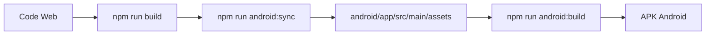

# 📋 Résumé de Configuration Android

Ce document résume toutes les modifications apportées au projet pour supporter le build APK Android.

## 🎯 Objectif Atteint

Le projet Gaia peut maintenant être compilé en APK Android facilement depuis GitHub Codespace avec un processus simple et rapide.

## ✅ Ce qui a été fait

### 1. Installation de Capacitor
- **Capacitor Core & CLI**: Framework pour convertir les apps web en apps natives
- **Capacitor Android**: Plateforme Android pour Capacitor
- Ajouté dans `package.json` avec `@capacitor/core`, `@capacitor/cli`, `@capacitor/android`

### 2. Configuration du Projet
- **Fichier `capacitor.config.ts`** créé avec:
  - App ID: `com.saintjoseph.gaia`
  - App Name: `Gaia`
  - Web Directory: `dist`
  - Android Scheme: `https` (pour HTTPS dans WebView)

### 3. Plateforme Android
- Projet Android ajouté dans le dossier `/android`
- Configuration pour **Android 15 (API 35)** comme target
- Support minimum: **Android 6.0 (API 23)**
- Build tools et Gradle configurés

### 4. Icônes de l'Application
- Conversion du `favicon.ico` en icônes Android
- Génération de toutes les tailles requises:
  - mdpi (48x48), hdpi (72x72), xhdpi (96x96)
  - xxhdpi (144x144), xxxhdpi (192x192)
- Icônes rondes et adaptatives incluses

### 5. Configuration de Signature
- **Script `generate-keystore.sh`**: Génère un keystore pour signer les APKs
- Configuration du `build.gradle` pour supporter:
  - Signature depuis `keystore.properties` (local)
  - Signature depuis variables d'environnement (CI/CD)
- Support pour APK Debug (non signé) et Release (signé)

### 6. Scripts de Build
Trois scripts principaux créés:

#### `scripts/build-android.sh`
- Build complet automatisé en une commande
- Vérification de Java 21
- Build web → Sync Capacitor → Build APK
- Détection automatique Debug/Release
- Messages colorés et informatifs

#### `scripts/setup-android-env.sh`
- Configuration automatique de l'environnement GitHub Codespace
- Installation de Java 21
- Configuration de JAVA_HOME
- Installation des dépendances npm

#### `scripts/generate-keystore.sh`
- Génération interactive d'un keystore
- Informations pré-remplies pour Lycée Saint Joseph
- Instructions pour l'utilisation

### 7. Commandes NPM
Nouvelles commandes ajoutées dans `package.json`:

```json
{
  "android:env": "Configuration de l'environnement",
  "android:build": "Build de l'APK",
  "android:sync": "Synchronisation web → Android",
  "android:setup": "Génération du keystore",
  "android:open": "Ouvrir dans Android Studio"
}
```

### 8. Documentation
Trois fichiers de documentation créés:

#### `ANDROID_BUILD_GUIDE.md`
- Guide complet du build Android
- Instructions détaillées pour GitHub Codespace
- Toutes les commandes disponibles
- Troubleshooting
- FAQ

#### `QUICK_START_ANDROID.md`
- Guide ultra-rapide en 2 commandes
- Instructions d'installation sur téléphone
- Commandes essentielles

#### `README.md` (mis à jour)
- Section Android ajoutée
- Quick start visible dès l'arrivée
- Liens vers la documentation complète

### 9. Configuration Git
- **`.gitignore`** mis à jour pour exclure:
  - Keystore files (`*.keystore`, `*.jks`)
  - Dossier `android/keystore/`
  - Fichier `android/keystore.properties`
- **`eslint.config.js`** mis à jour pour exclure le dossier `android`

### 10. Résolution de Problèmes
- **Java 21 requis**: Scripts vérifient et configurent automatiquement
- **Conflit Kotlin stdlib**: Résolu dans `android/build.gradle`
- **Build artifacts**: Exclus de Git via `.gitignore`

## 📊 Spécifications Finales

| Caractéristique | Valeur |
|-----------------|--------|
| Framework mobile | Capacitor 6.x |
| Android minimum | 6.0 (API 23) |
| Android target | 15 (API 35) |
| App ID | com.saintjoseph.gaia |
| Nom de l'app | Gaia |
| Taille APK | ~17 MB |
| Java requis | JDK 21 |
| Icône source | /public/favicon.ico |
| Build time | ~30-60s (première fois), ~5-10s (suivantes) |

## 🚀 Utilisation Rapide

### Pour un développeur sur GitHub Codespace:

```bash
# 1. Configuration (une seule fois)
npm run android:env

# 2. Build de l'APK
npm run android:build

# L'APK est dans: android/app/build/outputs/apk/debug/app-debug.apk
```

### Pour un APK signé (production):

```bash
# 1. Générer le keystore (une seule fois)
npm run android:setup

# 2. Créer android/keystore.properties avec:
#    storeFile=keystore/gaia-release.keystore
#    storePassword=VOTRE_MOT_DE_PASSE
#    keyAlias=gaia
#    keyPassword=VOTRE_MOT_DE_PASSE

# 3. Build
npm run android:build

# L'APK signé est dans: android/app/build/outputs/apk/release/app-release.apk
```

## 🔒 Sécurité

- Les keystores ne sont JAMAIS commités dans Git
- Les mots de passe ne sont JAMAIS dans le code
- Support pour variables d'environnement (CI/CD)
- `.gitignore` configuré pour protéger les secrets

## 📁 Structure des Fichiers

```
projet-gaia/
├── android/                          # Projet Android Capacitor
│   ├── app/
│   │   ├── src/main/
│   │   │   ├── res/                  # Resources (icônes, etc.)
│   │   │   └── java/                 # Code Java
│   │   └── build.gradle              # Config avec signature
│   ├── gradle/                       # Gradle wrapper
│   ├── build.gradle                  # Config build avec Kotlin fix
│   └── keystore/                     # Keystores (non commités)
├── scripts/
│   ├── build-android.sh              # Script de build principal
│   ├── setup-android-env.sh          # Setup environnement
│   └── generate-keystore.sh          # Génération keystore
├── capacitor.config.ts               # Configuration Capacitor
├── ANDROID_BUILD_GUIDE.md            # Guide complet
├── QUICK_START_ANDROID.md            # Guide rapide
└── README.md                         # README mis à jour
```

## 🎉 Avantages

1. **Simple**: 2 commandes pour builder l'APK
2. **Rapide**: Build en ~30-60 secondes
3. **GitHub Codespace Ready**: Configuration automatique
4. **Sécurisé**: Gestion des keystores et secrets
5. **Documenté**: 3 niveaux de documentation
6. **Flexible**: Support Debug et Release
7. **Moderne**: Android 15, Capacitor 6
8. **Professionnel**: Scripts robustes avec vérifications

## 🔄 Workflow de Développement



## 📱 Distribution

L'APK peut être:
- Partagé directement (fichier APK)
- Installé via USB
- Distribué via email/cloud
- Publié sur Google Play Store (avec APK signé)

## ⚠️ Important

1. **Java 21 est requis** - Le script `android:env` l'installe automatiquement
2. **Keystore pour production** - Générer avec `android:setup`
3. **Ne jamais commiter** le keystore ou les mots de passe
4. **Rebuild après modifications** - Toujours synchroniser avec `android:sync` ou `android:build`

## 🆘 Support

- **Guide complet**: `ANDROID_BUILD_GUIDE.md`
- **Quick start**: `QUICK_START_ANDROID.md`
- **Documentation Capacitor**: https://capacitorjs.com/docs

---

**Configuration réalisée avec succès! Le projet est prêt pour le build Android APK.** ✅
